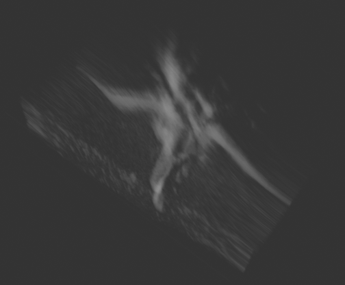
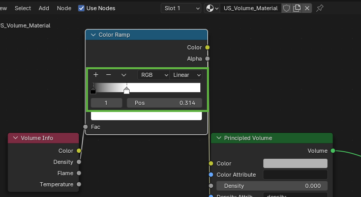

# Initialization using Mesh from ImFusion Suite

## 1. Apply Volume Compounding to US Sweep

You can select one or multiple sweeps and make sure to choose a suitable background intensity for better results:


You should get an output similar to the following:


## 2. Extract Mesh from Volume
You can extract a mesh from the volume by using Algorithms > Segmentation > Extract Mesh functionality and make sure to  choose a suitable ISO value:


## 3. Export Mesh 


## 4. Get Pointcloud from Mesh
To initialize the 3D Gaussians we can use the positions of vertices and save them as the point cloud we will use to place our initial 3D Gaussians. \

``` python mesh_to_pcl.py -i <input_mesh_path> -o <output_pcl_path>```


# Initialization using Volume Rendering in Blender

## 1. Export Sweep as a DICOM File


## 2. Set Directory path to DICOM File
Change this line in code to your local directory: \
``` directory = r'/Users/ahmedkadri/Documents/Lectures/RCI_Prakitkum/ultra_splatting/spine_phantom/dicomdir'```

## 3A. Run script in Blender
You should get something similar to this volume: 



You can play around with the slider parameter to get better rendering results for your specific model:



## 4. From Volume to Pointcloud

By reading the .npy file you saved from blender, you save the 3D points as ply file to get the pointcloud, which should look something like this:


## 5. Blender missing dependency
If you need to install a missing dependency into the python API of blender, add this at the top of your script:

```Python import subprocess
# Example to install pydicom package 
import sys
def install(package):
    subprocess.check_call([sys.executable, "-m", "pip", "install", package])
install('pydicom')
```
## 6. Debugging Blender scripts
To see debug messages and console outputs of python scripts within blender, you need to launch blender from the terminal by following this manual for your operating system:
[Launching Blender from the Command Line](https://docs.blender.org/manual/en/latest/advanced/command_line/launch/index.html#command-line-launch-index) 


## 7. Change the render engine from EEVEE to Cycles in Blender
Change the render engine to Cycles for better visualization quality

